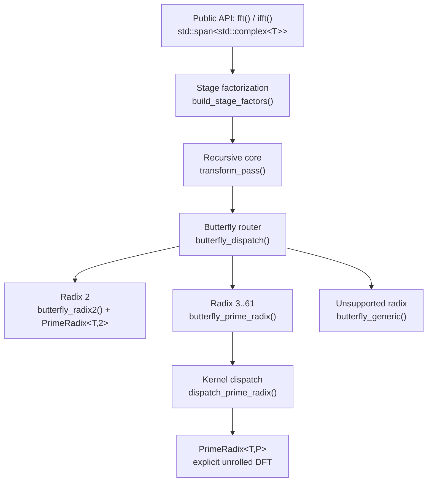

# MosaiQ-Singleton-FFT: Complex Mixed-Radix Algorithm Structure

**Status:** Architecture Specification (v1.0)  
**License Holder:** Bona Sapiens, Inc.  
**Scope:** Recursive Cooley–Tukey mixed-radix decimation engine and compile-time prime radix butterfly expansion for the complex in-place FFT.

---

## 1. Architectural Overview

`MosaiQ-Singleton-FFT` implements an in-place complex fast Fourier transform over arbitrary composite lengths \(N\) whose prime factors do not exceed 61. The transform decomposes \(N\) into a stage sequence, recursively decimates the input into sub-DFTs, and recombines partial results through radix-\(P\) butterfly kernels at each stage.

The forward transform is defined as

\[
X_k = \sum_{n=0}^{N-1} x_n \exp\!\left(-\frac{2\pi i\, kn}{N}\right).
\]

The inverse transform applies the conjugate exponential and scales by \(1/N\).

### 1.1 Departure from Legacy Digit-Reversal Pipelines

Naive Singleton-style implementations that prepend a mixed-radix digit-reversal permutation and then execute iterative DIT stages exhibit a structural failure when radix-4 and radix-2 stages are interleaved. For \(N = 128\), a factorization such as \([4, 4, 2, 2, 2]\) induces a digit-reversal base that is not equivalent to binary bit-reversal; the resulting index permutation is incorrect, and the forward–inverse round-trip diverges.

`MosaiQ-Singleton-FFT` eliminates this class of failure by adopting a **recursive decimation schedule** (KissFFT-style `kf_work` semantics):

1. Recursively partition the input into \(P\) sub-transforms of size \(M\) for stage radix \(P\).
2. Apply stage twiddle factors to butterfly legs.
3. Recombine via an explicit radix-\(P\) kernel.

No global bit-reversal or mixed-radix digit-reversal pass is required. Complexity remains \(O(N \log N)\).

---

## 2. Module Topology and Data Flow



| Module | File | Responsibility |
|--------|------|----------------|
| Public API | `src/SingletonFFT.hpp` | `fft()`, `ifft()`, `factorize()`, `factorize_ct<N>()` |
| Transform engine | `src/SingletonFFT.cpp` | Twiddle table, recursive passes, butterfly orchestration |
| Prime radix kernels | `src/detail/PrimeRadix.hpp` | Template-unrolled \(P\)-point DFT butterflies |
| Validation | `tests/test_fft.cpp` | Factorization, round-trip, impulse tests |

---

## 3. Factorization Subsystem

Two factorization paths exist: one for the transform engine, one for the public Singleton-style API.

### 3.1 Runtime Stage Factors (`build_stage_factors`)

The active FFT path builds a KissFFT-compatible stage buffer:

\[
[P_0,\, M_0,\, P_1,\, M_1,\, \ldots,\, P_{S-1},\, M_{S-1}]
\]

where \(P_i\) is the stage radix and \(M_i\) is the remaining sub-length after division. Radices are selected greedily (powers of 4, then 2, then odd primes up to \(\lfloor\sqrt{N}\rfloor\), then the residual factor).

### 3.2 Public Factorizer (`factorize` / `factorize_ct`)

The exported `factorize()` and `consteval factorize_ct<N>()` implement a Singleton-oriented decomposition:

- Extract factors of 4 while \((N/4) \neq 2\) (avoids the \([4, 2]\) trap that breaks radix-4 extraction).
- Extract remaining factors of 2.
- Trial-divide odd primes from 3 upward.
- Emit any residual prime \(\leq 61\).

`ConstFactorization` stores compile-time results in a fixed `std::array` with zero heap allocation.

**Example:** \(N = 442 = 2 \times 13 \times 17\) yields factors `[2, 13, 17]`, exercising expanded prime radices 13 and 17 in validation.

---

## 4. Recursive Transform Core (`transform_pass`)

At each stage with radix \(P\) and group count \(M\):

1. **Base case** (\(M = 1\)): copy \(P\) decimated input samples into the output buffer with stride advancement.
2. **Recursive case** (\(M > 1\)): invoke `transform_pass` on \(P\) sub-blocks, each of length \(M\), with stride multiplied by \(P\).
3. **Butterfly recombination**: call `butterfly_dispatch` on the \(P \times M\) output block.

Twiddle factors are precomputed once per transform:

\[
W_N^{\,k} = \exp\!\left(\frac{\mathrm{sign} \cdot 2\pi i\, k}{N}\right), \quad k = 0, \ldots, N-1
\]

with \(\mathrm{sign} = -1\) for forward and \(+1\) for inverse.

In-place operation uses a scratch buffer of length \(N\); results are copied back to the caller's span after the recursive pass completes.

---

## 5. Prime Radix Butterfly Expansion (`PrimeRadix.hpp`)

The **Crucial Lemma** of this engine: all supported radices through 61 are handled by explicitly instantiated template kernels, not by a runtime \(O(P^2)\) loop with unknown \(P\).

### 5.1 Supported Radices

\[
\{2,\, 3,\, 4,\, 5,\, 7,\, 11,\, 13,\, 17,\, 19,\, 23,\, 29,\, 31,\, 37,\, 41,\, 43,\, 47,\, 53,\, 59,\, 61\}
\]

### 5.2 Template Structure

```cpp
template <std::floating_point T, std::size_t P>
struct PrimeRadix {
    static void apply(std::span<std::complex<T>, P> x, int sign) noexcept;
};
```

For general \(P\), `apply` evaluates the unrolled \(P\)-point DFT:

\[
Y_k = \sum_{j=0}^{P-1} x_j \cdot \exp\!\left(\frac{\mathrm{sign} \cdot 2\pi i\, jk}{P}\right).
\]

`PrimeRadix<T, 2>` is specialized to a single add/subtract pair (no trigonometric calls).

`dispatch_prime_radix()` performs a compile-time-resolved `switch` over \(P\), binding each case to `PrimeRadix<T, P>::apply` with a fixed-extent `std::span<std::complex<T>, P>`.

### 5.3 Stage Butterfly with Twiddles (`butterfly_prime_radix`)

For each butterfly group \(g\) at stage radix \(P\):

1. **Gather** \(P\) samples at stride \(M\): `scratch[q] = output[g + q·M]`.
2. **Twiddle** legs \(q = 1, \ldots, P-1\):
   \[
   \texttt{scratch}[q] \leftarrow \texttt{scratch}[q] \cdot W_N^{\,(\texttt{stride} \cdot g \cdot q)}
   \]
3. **Apply** `dispatch_prime_radix(scratch, P, sign)`.
4. **Scatter** results back to `output[g + q·M]`.

Radix 2 uses `butterfly_radix2`, which multiplies the odd leg by a running twiddle index and delegates the pairwise sum/difference to `PrimeRadix<T, 2>`.

### 5.4 Generic Fallback

`butterfly_generic` implements the KissFFT `kf_bfly_generic` twiddle accumulation for radices outside the supported set. It is retained as a structural safety net; all lengths validated in the test suite factor exclusively into supported radices.

---

## 6. Bona Sapiens Determinism Contract

The following invariants are enforced at compile time and verified by the test suite.

| Invariant | Enforcement |
|-----------|-------------|
| **Span-only memory interface** | `fft()` and `ifft()` accept `std::span<std::complex<T>>` exclusively. |
| **Zero raw pointers in butterfly kernels** | `PrimeRadix::apply` operates on `std::span<std::complex<T>, P>`. |
| **Type safety** | Scalar type `T` is constrained by the `FloatingPoint` concept (`std::floating_point<T>`). |
| **Forward convention** | \(\exp(-2\pi i kn/N)\). |
| **Inverse convention** | \(\exp(+2\pi i kn/N)\) with exact \(1/N\) normalization. |
| **Numerical tolerance** | Double-precision round-trip error \(< 10^{-12}\) for \(N \in \{64, 128, 81, 442\}\). |

Internal scratch buffers (`std::vector`, `std::array`) are function-local or stack-allocated; no `new`/`delete` appears in the transform path.

---

## 7. Validation Matrix

| Test | Length | Radices Engaged | Tolerance |
|------|--------|-----------------|-----------|
| Power of two | 64, 128 | 2, 4 | \(10^{-12}\) (double) |
| Power of three | 81 | 3 | \(10^{-12}\) (double) |
| Mixed prime | 442 | 2, 13, 17 | \(10^{-12}\) (double) |
| Float smoke | 442 | 2, 13, 17 | \(10^{-5}\) (float) |
| Impulse | 61 | 61 | \(10^{-12}\) (double) |

---

## 8. Legacy Provenance

Historical source material — including Richard C. Singleton's original mixed-radix FFT publications, Fortran reference implementations, and related lecture notes — must be placed under:

```
docs/legacy/
```

**Action required (manual):** Copy legacy PDFs, scanned papers, and reference source archives into `docs/legacy/` from the predecessor repository or personal archive. Do not commit copyrighted material without license verification. Filename convention: `SINGLETON_<YEAR>_<SHORT_TITLE>.pdf`.

---

## 9. References

- R. C. Singleton, "Mixed Radix Fast Fourier Transforms," in *Programs for Digital Signal Processing*, IEEE Press, 1979.
- M. Borgerding, KissFFT: mixed-radix recursive FFT (reference decimation schedule).
- Bona Sapiens, Inc., `README.md` — build, integration, and public API summary.
